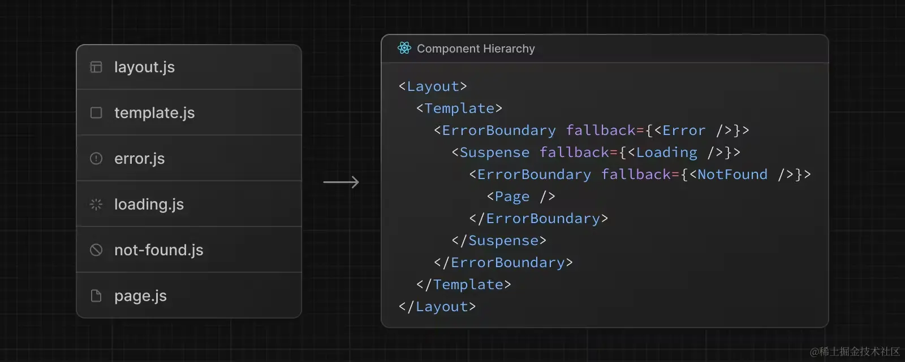

Next.js 的路由分为两种
 - pages 路由

    ```
        pages 路由目录结构
        └── pages
            ├── index.js
            ├── about.js
            └── more.js
    ```
 - app 路由 （13.4版本后，默认为 app 路由）
    ```
        app 路由目录结构
        src/
        └── app
            ├── page.js 
            ├── layout.js
            ├── template.js
            ├── loading.js
            ├── error.js
            └── not-found.js
            ├── about
            │   └── page.js
            └── more
                └── page.js
    ```
虽然两者可以共存，但 App Router 的优先级要高于 Pages Router。而且如果两者解析为同一个 URL，会导致构建错误

layout.js 会把 page.js 作为 children 作为属性传入进去，然后进行布局，也有可能是子布局

layout.js 支持嵌套

1. app/layout.js 是必须的
2. app/layout.js 必须包含 html 和 body 标签
3. 可以使用路由组创建多个根布局
4. 默认根局部是服务端组件，且不能设置成客户端组件

template.js 用法同 layout.js，但是他会保持状态保持，如果两个都有的话，那么渲染出来的结构为
```
<Layout>
  {/* 模板需要给一个唯一的 key */}
  <Template key={routeParam}>{children}</Template>
</Layout>
```
模板比布局更适合：
- 依赖于 useEffect 和 useState 的功能，比如记录页面的访问次数，还有每次表单重写，因为在维持状态的特性，所以在切换路由的时候会去记录（保持状态是保持原来的状态）
- 更改框架的默认行为，举个例子，布局内的 Suspense 只会在布局加载的时候展示一次 fallback UI，当切换页面的时候不会展示。但是使用模板，fallback 会在每次路由切换的时候展示。

目录层级关系


global-error.js 用来处理根布局和根模板中的错误，app/error.js 建议还是要写的

useRouter 注意使用该 hook 需要在客户端组件中。（顶层的 'use client' 就是声明这是客户端组件）