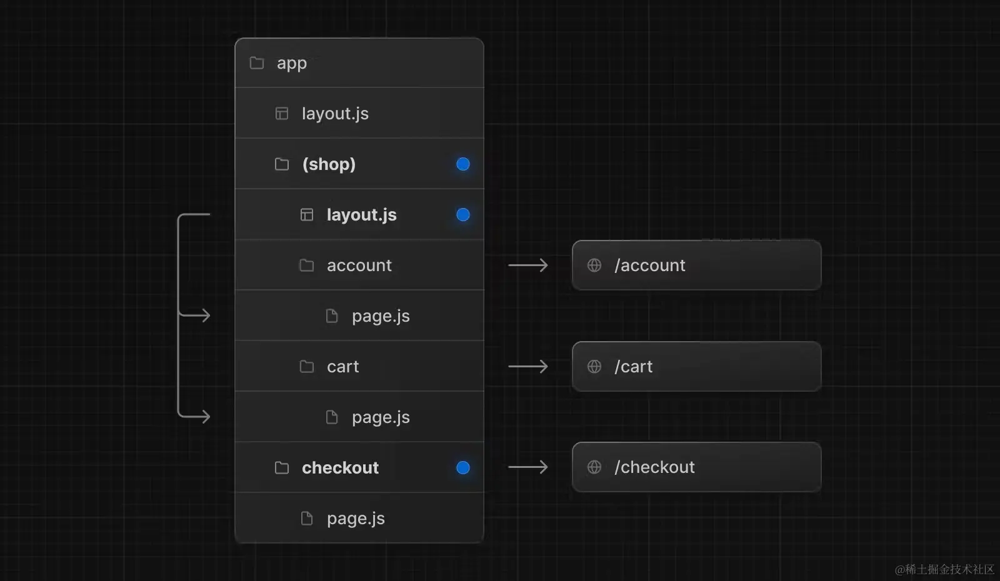

1. 动态路由

    需要注意的点就[[...slug]]存在的话，这个文件夹同一层级就不能有page.js.
    /blog/[[...slug]]   :   blog or  blog/1/2/3 不带参数的路由也会匹配
    /blog/[...slug]     :   blog/1/2/3          必须带参数
    /blog/[slug]        :   blog/1

2. 路由组

    不同路由组下的文件夹名不能相同，包括跟他们同一级的
    

    在这个例子中，/account 、/cart、/checkout 都在同一层级。但是 /account和 /cart使用的是 /app/(shop)/layout.js布局和app/layout.js布局，/checkout使用的是 app/layout.js

    - 路由组的命名除了用于组织之外并无特殊意义。它们不会影响 URL 路径。
    - 注意不要解析为相同的 URL 路径。举个例子，因为路由组不影响 URL 路径，所以 (marketing)/about/page.js和 (shop)/about/page.js都会解析为 /about，这会导致报错。
    - 创建多个根布局的时候，因为删除了顶层的 app/layout.js文件，访问 /会报错，所以app/page.js需要定义在其中一个路由组中。
    - 跨根布局导航会导致页面完全重新加载，就比如使用 app/(shop)/layout.js根布局的 /cart 跳转到使用 app/(marketing)/layout.js根布局的 /blog 会导致页面重新加载（full page load）。

    3. 平行路由
    平行路由可以在同一个布局下同时或者有条件的渲染多个页面，类似于 Vue 插槽
    平行路由的使用方式就是将文件夹以 @作为开头进行命名，这个文件夹下面的 page.js 将会自动注入文件夹同级 layout 的 props 中。
    使用场景：a 情况需要展示 a 页面，b 情况需要展示 b 页面。

    4. 拦截路由
    拦截路由允许你在当前布局内加载应用其他部分的路由。
    但是要注意的是，这个匹配的是路由的层级而不是文件夹的层级，就比如路由组、平行路由这些不会影响 URL 的文件夹就不会被计算层级。
    用其他路由拦截当前路由 a/c  从 a - > c 就会被拦截，其他路由到 c 就不会拦截